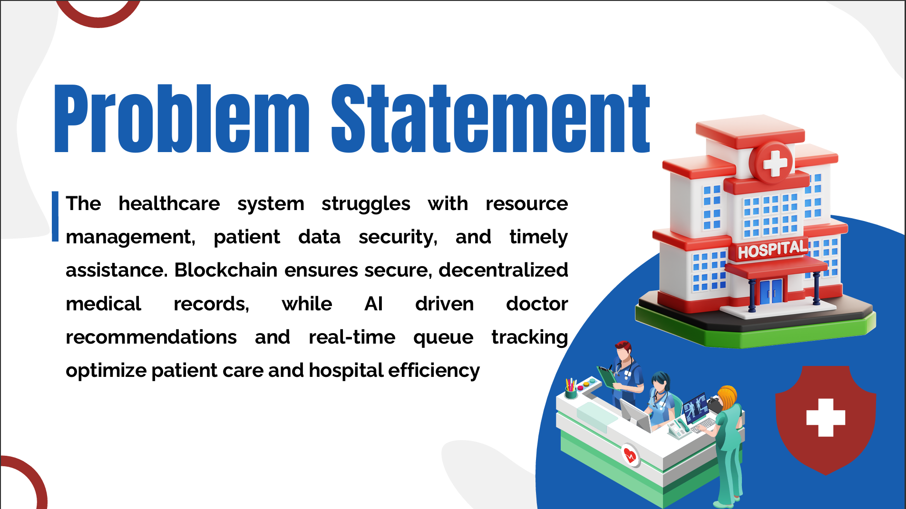
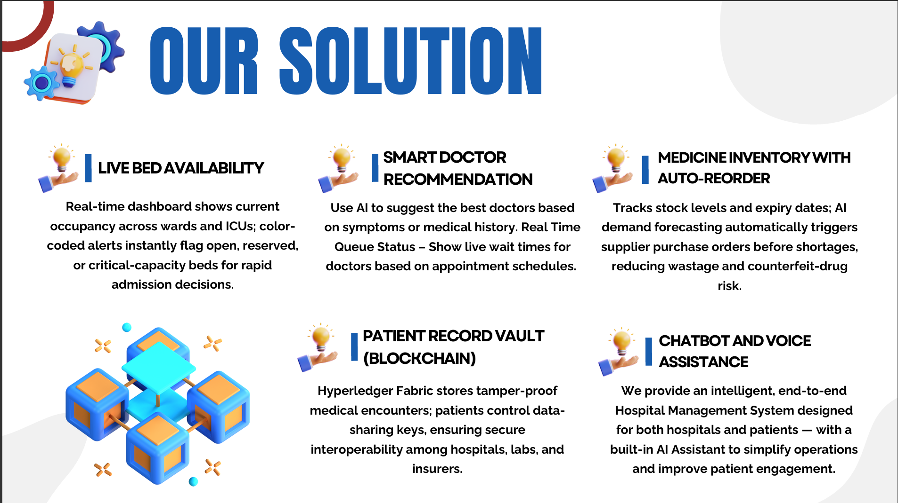
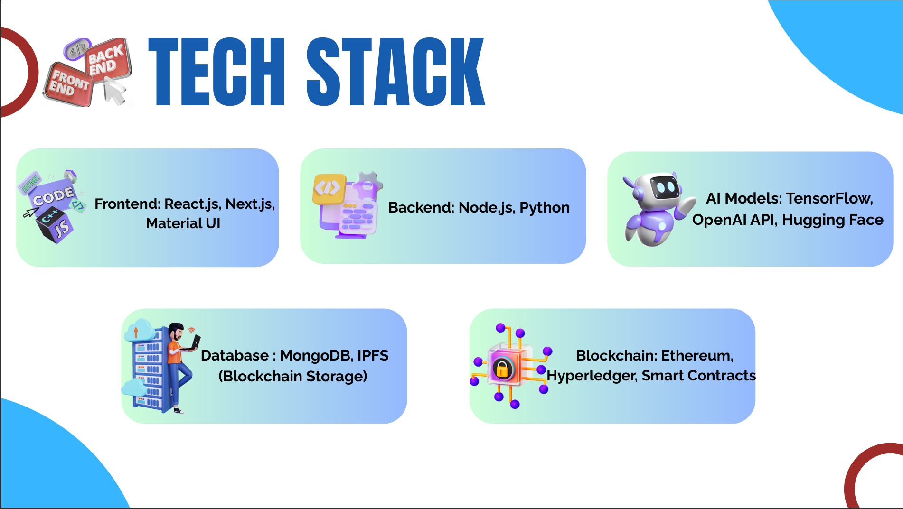
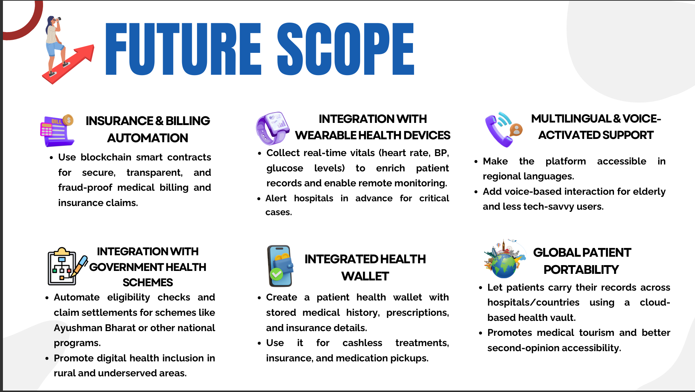
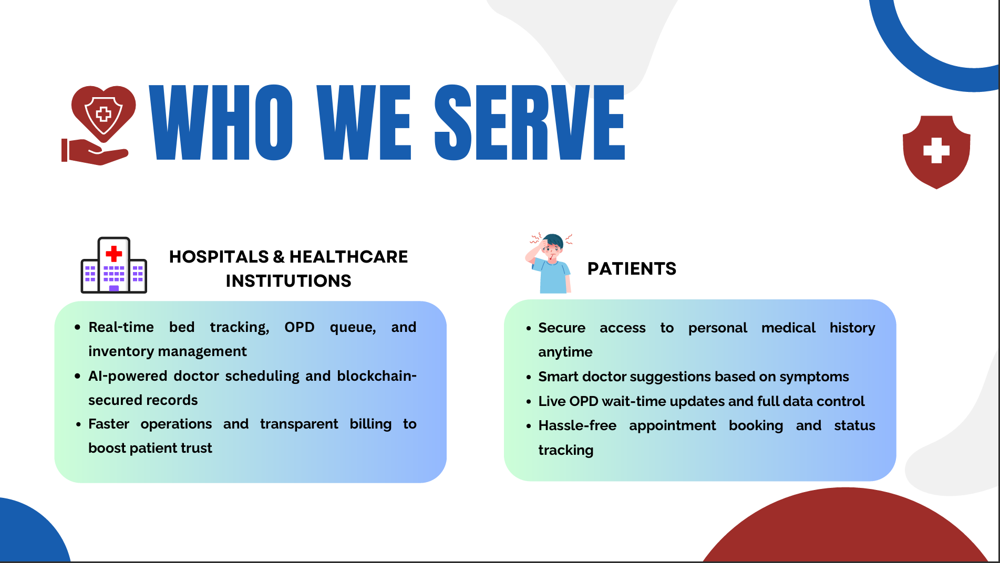

# **LifeLineX: AI & Blockchain-powered Smart Healthcare**  

<!--

-->

---

## 📌 **Project Overview**  
LifeLineX revolutionizes healthcare by integrating **AI & Blockchain** to optimize hospital operations, enhance patient care, and secure medical records. Our **smart hospital management system** provides **real-time bed tracking, AI-powered doctor recommendations, and blockchain-secured patient data**, ensuring efficiency, transparency, and security.  

---

## 💡 **Problem Statement**  
Healthcare institutions struggle with:  
- **Bed Management Issues** – Difficulty in tracking and assigning available beds.  
- **Long OPD Queues** – Inefficient scheduling and resource management.  
- **Medicine Inventory Challenges** – Stock shortages and counterfeit drug risks.  
- **Patient Data Security Concerns** – Vulnerable records with limited control over sharing.  

LifeLineX tackles these issues with **AI-driven predictions and Blockchain-powered record management**, leading to better healthcare accessibility and security.  

---

## 🔑 **Core Features**  
### **AI-Powered Enhancements**  
✔️ **Smart Doctor Recommendations** – AI suggests the best doctors based on symptoms & medical history.  
✔️ **Real-time Queue Management** – AI forecasts wait times, reducing patient frustration.  
✔️ **Medicine Stock Prediction** – AI detects stock shortages & automates restocking.  
✔️ **AI Chatbot & Voice Assistant** – Helps patients with appointment booking & hospital queries.  

### **Blockchain-Based Security**  
✔️ **Decentralized Patient Records** – Hyperledger ensures tamper-proof medical history storage.  
✔️ **Patient-Controlled Data Sharing** – Users manage who accesses their health records.  
✔️ **Transparent Billing & Smart Contracts** – Automates payments & fraud prevention mechanisms.  

### **User Functionalities**  
| **Feature**         | **Patients** | **Hospital Admins** |
|---------------------|-------------|----------------------|
| Appointment Booking | ✅ Book doctor consultations | ✅ Manage doctor schedules |
| Queue Tracking     | ✅ View OPD wait time | ✅ Optimize patient flow |
| Bed Availability   | ✅ Check hospital bed status | ✅ Update occupancy details |
| Medicine Inventory | ✅ View stock availability | ✅ Manage stock levels & expiry dates |
| Secure Records    | ✅ Access medical history | ✅ Store & share patient data securely |

---

## 🛠 **Tech Stack**  
⚙️ **Frontend:** React.js, Next.js, Material UI  
🖥 **Backend:** Node.js, Python (FastAPI)  
🗄 **Database:** MongoDB, PostgreSQL, IPFS (Blockchain Storage)  
🤖 **AI Models:** TensorFlow, OpenAI API, Hugging Face  
🔗 **Blockchain:** Ethereum, Hyperledger, Smart Contracts  
☁ **Cloud & DevOps:** AWS, Docker, Kubernetes  

---

## 🚀 **Why LifeLineX?**  
✅ **Faster Hospital Operations** – AI optimizes bookings, diagnoses & inventory tracking.  
✅ **Enhanced Security & Transparency** – Blockchain protects patient records & ensures fraud-free billing.  
✅ **Seamless Patient Experience** – Easy access to medical care with AI-powered assistance.  

---

## 🙌 **Contributors & Contact**  
👨‍💻 **Team PulseCoders**  
📧 Contact Us: rajneeshsinghdev6453@gmail.com

